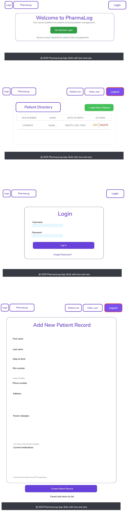

 

# PharmaLog

## PharmaLog Entity-Relationship Diagram
This model defines three entities, ensuring patient data is linked to the authenticated user who created it, and that roles are managed separately.

| Entity | Attributes | Relationships |
|--------|------------|---------------|
| User (Built-in) | id, username, email, password, is_staff, is_active | 1:1 with UserProfile |
| UserProfile (Custom) | id, user (FK to User), role (CHAR: Admin, Pharmacist, Technician) | 1:1 with User |
| Patient | id, name, date_of_birth, phone, allergies (TEXT), medications (TEXT), created_by (FK to User) | M:1 with User (via created_by) |

### Relationship Explanation
1. User ↔ UserProfile (One-to-One): Every Django user will have exactly one profile to store their assigned role (Admin, Pharmacist, or Technician). This is how you'll enforce role-based authorization.
2. User ↔ Patient (One-to-Many): Every Patient record is associated with the User who created it (`created_by` field). This fulfills the requirement that your custom entity relates to the User model and allows you to enforce the UI/UX requirement that only the creator can edit/delete the record.

* FK - Foreign Key - linking id of one table to another - This means Patient model has a `created_by` field that is a Foreign Key pointing to Django's built-in User model.
* The `created_by` field essentially stores the id of the user who created that patient record.
* M:1 - Many to One relationship - reacting to FK and creating multiple patient records by one user.

### ERD Image
Below is the exported diagram (from Excalidraw) illustrating the entities and relationships described above.

## MVP User Stories

### Authentication & Authorization
1. As a Guest, I want to see a landing page, so that I can understand what the app does and choose to log in or register.
2. As a Guest, I want to be able to register for a new account, so that I can become an authorized user.
3. As a User, I want to log into my account, so that I can access the patient management features.
4. As a User, I want to log out, so that I can secure my session.
5. As a Technician, I want to be prevented from accessing the 'Create New Patient' form, so that I cannot accidentally modify core data.
6. As a Guest, I want to be redirected to the login page if I try to view any patient-related pages.

### Patient CRUD (Read)
1. As an Authenticated User (Pharmacist/Technician/Admin), I want to view a paginated list of all patients, so that I can quickly search and manage records.
2. As an Authenticated User, I want to view a detail page for a specific patient, so that I can review their full profile (DOB, allergies, medications).

### Patient CRUD (Create, Update, Delete)
1. As an Admin or Pharmacist, I want to access a form to create a new patient record, so that I can onboard a new client.
2. As an Admin or Pharmacist, I want to update the details of a patient I created, so that I can keep their information current.
3. As an Admin or Pharmacist, I want to see a delete button for patients I created, so that I can remove outdated or erroneous records.
4. As a User, I want the edit and delete buttons to be hidden for any patient records I did not create, ensuring data ownership and security.

## Wireframe Descriptions
The app needs a clean, professional, and accessible layout that utilizes CSS Flexbox and/or Grid for structure. (CSS AND TAILWIND)

### 1. Patient Index Page (Main View)
* Layout: Uses a main container centered on the page.
* Header: Fixed navigation bar with the App Name/Logo, links to "Patients," and "Logout." Displays the current user's role (e.g., "Welcome, Pharmacist").
* Content:
	* A prominent "Add New Patient" button (ONLY visible to Admin/Pharmacist).
	* A simple search/filter bar above the list.
	* The main content area is a responsive Grid or Table displaying patient cards/rows (Name, DOB, Phone).
* Actions: Each patient row/card has a "View Details" link. Edit and Delete icons are only visible if the current user is an Admin/Pharmacist AND the record creator.

### 2. Patient Detail Page
* Layout: Two-column Flexbox or Grid.
* Left Column (70%): Patient's core information (Name, DOB, Contact). Large text area for Medications and Allergies.
* Right Column (30%): A summary box showing Metadata (Created By: username, Date Created, Last Updated).
* Actions:
	* Edit Button (Prominent, styled).
	* Delete Button (Red, styled, requires confirmation modal, not alert()).
	* These buttons are ONLY visible to the record creator (Admin/Pharmacist role).
* Navigation: A "Back to List" link.

### 3. Patient Form (Create/Update)
* Layout: A single, centered form container.
* Fields: Clear labels and inputs for all Patient model fields:
	* Name (Text Input)
	* Date of Birth (Date Input)
	* Phone (Text Input)
	* Allergies (Text Area)
	* Medications (Text Area)
* Pre-filling (Update): For the "Update" view, all fields must be pre-filled with the existing data.
* Button: A large, styled submit button (e.g., "Save Patient" or "Update Record").

### 4. Login/Registration Page
* Layout: Simple, centered card or box using Flexbox to vertically center the content.
* Content: Form fields for username/email and password. Links to switch between Login and Register views.
* Styling: Must match the overall visual theme.

